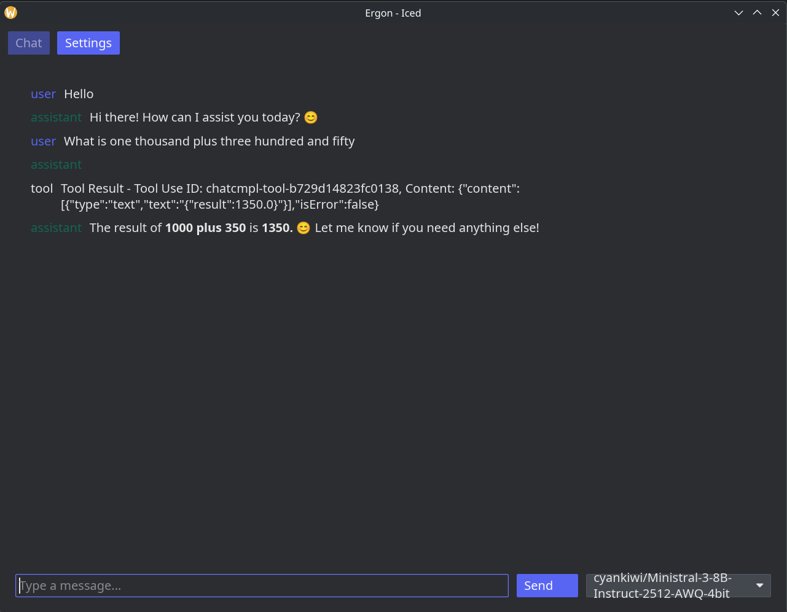

# Ergon

[](https://github.com/milarze/ergon/actions/workflows/rust.yml)

An LLM chat interface built in Rust.



## Features

- Models
  - Supports multiple LLMs
- MCP
  - StreamableHTTP (TODO)
  - STDIO
- Multimodal
  - Text
  - Images
  - Audio
  - Files

## Installation

```bash

cargo install ergon
```
