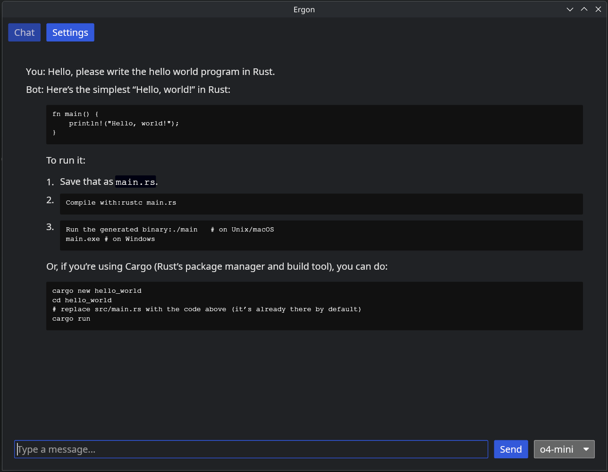

# Ergon

[](https://github.com/milarze/ergon/actions/workflows/rust.yml)

An LLM chat interface built in Rust.



## Features

- Models (TODO)
  - Supports multiple LLMs
- MCP (TODO)
  - StreamableHTTP
  - STDIO

## Installation

```bash

cargo install ergon
```
